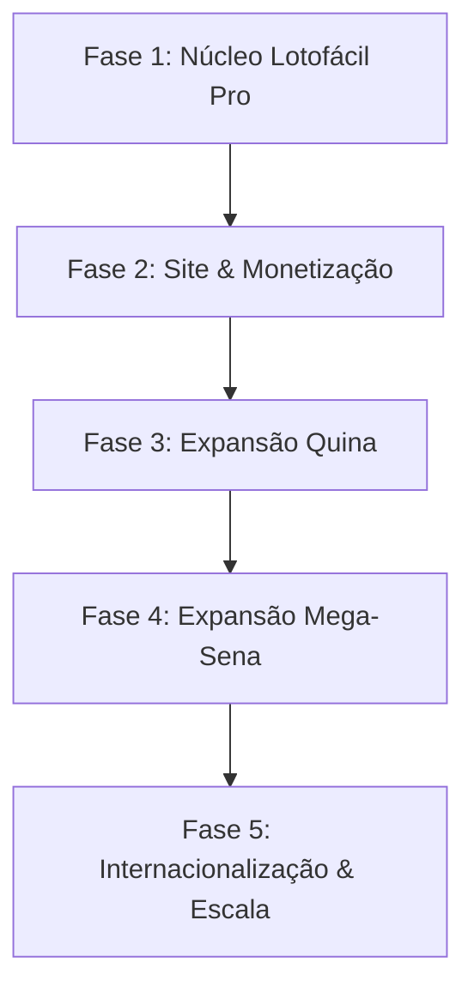

# Plano de Fases – LotoFácil Pro
> Documento de visão e planejamento do produto  
> (Complementar ao README técnico)

---

## 1. Visão Geral do Produto

O **LotoFácil Pro** nasce como um núcleo técnico (este repositório) e evolui para:

- Um **SaaS de análise e geração de jogos** para Lotofácil (e depois Quina / Mega-Sena).
- Um site com **assinatura mensal**, relatórios e ferramentas para apostadores.
- Monetização híbrida:
  - Assinaturas.
  - Google AdSense (tráfego de conteúdo).
  - Futuras parcerias / afiliados.

---

## 2. Fases do Projeto

Visão geral das fases:

---

## 3. Fase 1 – Núcleo Lotofácil Pro

**Objetivo:**  
Ter um motor de geração de jogos para Lotofácil **confiável**, **medido** e **superior ao baseline V9**.

### 3.1. Entregáveis

- Motor **V9** estável (score simplificado) – baseline.
- Motor **V10** (score estrutural adaptativo) ajustado para:
  - Imitar o perfil estatístico do V9 (soma, faixas, repetição).
  - Superar o V9 em backtests.
- Scripts:
  - `rodar_backtest_v9_v10.py` – comparativo de desempenho.
  - `analisar_motor_v9.py` – perfil estatístico dos jogos V9.
  - (Opcional) `analisar_motor_v10.py` – perfil estatístico dos jogos V10.
- Base de concursos da Lotofácil atualizada.

### 3.2. Critérios de Sucesso (KPIs)

- **Dados:**
  - Precisão 100% do histórico (batendo com site oficial da Caixa).
- **Desempenho dos motores (backtests com 200–500 concursos, 10 jogos/conc., modo BALANCEADO):**
  - V10 com:
    - Média ≥ **9.10**.
    - % de jogos com 11+ acertos ≥ **12.5%**.
    - % de jogos com 12+ acertos ≥ **2.1%**.
- **Performance:**
  - Tempo de geração de jogo: ≤ **1s**.

### 3.3. Prazo sugerido

- **Duração estimada:** 4–6 semanas, dependendo dos ciclos de teste/ajuste.

---

## 4. Fase 2 – Site & Monetização (Lotofácil)

**Objetivo:**  
Transformar o núcleo técnico em um **produto utilizável pelo público**, com cobrança recorrente e base para tráfego/Ads.

### 4.1. Entregáveis

1. **Frontend / Site**
   - Landing page focada em Lotofácil Pro:
     - Benefícios.
     - Prints / exemplos de acertos.
     - Call-to-action (teste gratuito, plano mensal).
   - Dashboard do assinante:
     - Geração de jogos (usando o motor V10).
     - Histórico de jogos.
     - Estatísticas simples (média de acertos, melhores resultados).

2. **Assinaturas**
   - Integração com:
     - Stripe, Mercado Pago ou similar.
   - Planos (exemplo):
     - Básico – X jogos/dia.
     - Premium – mais jogos + recursos extras.
   - Área de gerenciamento:
     - Upgrade/downgrade.
     - Cancelamento.
     - Histórico de cobrança.

3. **Monetização via Ads**
   - **Google AdSense**:
     - Blocos 300×250, 728×90, 160×600 nas páginas de conteúdo (não na página principal de venda).
   - Preparação para **Google Ads**:
     - Landing page otimizada.
     - Google Analytics 4 + Tag Manager configurados.

### 4.2. Critérios de Sucesso (KPIs)

- **Site / UX:**
  - Tempo de carregamento < **3s** (desktop), < **4s** (mobile).
  - Uptime ≥ **99.9%**.

- **Funil de conversão (Lotofácil):**
  - Visita → cadastro: ≥ **5%**.
  - Cadastro → assinatura: ≥ **2%**.
  - Churn mensal (cancelamento): ≤ **5%**.

- **Ads:**
  - Google Ads Lotofácil (fase inicial de testes):
    - CPC médio ≤ **R$ 1,50**.
    - ROI (receita de novas assinaturas / gasto em Ads) ≥ **150%**.
  - AdSense:
    - Receita ≥ **US$ 20** por **10k visitas/mês** (meta inicial).

### 4.3. Prazo sugerido

- **Duração estimada:** 8–10 semanas, incluindo:
  - 3–4 semanas para site + dashboard.
  - 2–3 semanas para pagamentos + testes.
  - 2–3 semanas para ajustes finos + primeira campanha Ads.

---

## 5. Fase 3 – Expansão Quina

**Objetivo:**  
Adicionar a **Quina** como segundo produto dentro da mesma plataforma, aumentando o ticket médio e o valor percebido.

### 5.1. Entregáveis

- Motor Quina (ex.: `score_quina.py`):
  - Lógica análoga à Lotofácil:
    - Frequência, recência, atraso, soma, faixas, repetição, etc.
- Integração no dashboard:
  - Aba ou seletor: “Lotofácil / Quina”.
- Planos:
  - Upsell “Lotofácil + Quina” com valor incremental.
- Primeiras campanhas de Google Ads específicas para Quina.

### 5.2. Critérios de Sucesso (KPIs)

- **Técnicos:**
  - Tempo de geração de jogo Quina: ≤ **1.2s**.
  - Histórico da Quina correto e atualizado.

- **Negócio:**
  - Pelo menos **5%** dos assinantes de Lotofácil aderindo ao módulo Quina (upsell).
  - Retenção de upsell: ≥ **80%** dos que aderirem permanecendo após 3 meses.
  - CPC médio Quina: ≤ **R$ 2,00**.
  - ROI das campanhas Quina: ≥ **150%**.

### 5.3. Prazo sugerido

- **Duração estimada:** 6–8 semanas.

---

## 6. Fase 4 – Expansão Mega-Sena

**Objetivo:**  
Usar a Mega-Sena como **funil de topo** (atrair muita gente com conteúdo/curiosidade) e, depois, direcionar para Lotofácil/Quina.

### 6.1. Entregáveis

- Motor Mega-Sena:
  - Focado em:
    - Simulação de probabilidades.
    - Fechamentos e estatísticas.
    - Conteúdo educativo.
- Conteúdos/funcionalidades:
  - Simulador “E se eu jogar esses 6, qual a chance?”.
  - Artigos do tipo:
    - “Por que é tão difícil ganhar na Mega-Sena?”
    - “Quantas combinações existem na Mega-Sena?”.
- Cross-sell:
  - Página mostrando: “Se você gosta de Mega-Sena, veja como é mais fácil chegar em prêmios na Lotofácil/Quina”.

### 6.2. Critérios de Sucesso (KPIs)

- Volume de tráfego orgânico e pago vindo de:
  - Palavras-chave “Mega-Sena”, “probabilidade Mega-Sena”.
- Taxa de conversão Mega-Sena → outros produtos:
  - Ex.: pelo menos **3–5%** dos usuários da área Mega-Sena criando conta no sistema.
- Engajamento:
  - Tempo médio na página Mega-Sena acima de **2–3 minutos**.

### 6.3. Prazo sugerido

- **Duração estimada:** 6–10 semanas.

---

## 7. Fase 5 – Internacionalização & Escala

**Objetivo:**  
Abrir caminho para mercados estrangeiros e escala maior.

### 7.1. Entregáveis

- Site em múltiplos idiomas:
  - Português (BR),
  - Inglês (EN),
  - Espanhol (ES) inicialmente.
- Ajustes:
  - Moeda e preços.
  - Formato de data/número.
  - Regras de pagamento (Stripe, etc.).
- Compliance:
  - Checar restrições sobre:
    - jogos de azar,
    - publicidade,
    - proteção de dados em cada país.

### 7.2. Critérios de Sucesso (KPIs)

- % de tráfego não-BR crescendo mês a mês (ex.: +5–10%).
- Novas assinaturas internacionais.
- Ausência de problemas legais/suspensões em:
  - Gateways de pagamento,
  - Google Ads,
  - Google AdSense.

---

## 8. Linha do Tempo Resumida (Sugestão)

| Fase | Duração Estimada | Principal Entregável |
|------|------------------|----------------------|
| 1 – Núcleo Lotofácil Pro | 4–6 semanas | V10 superior ao V9 em backtests |
| 2 – Site & Monetização   | 8–10 semanas | Site + Dashboard + Assinaturas + Ads prontos |
| 3 – Expansão Quina       | 6–8 semanas | Módulo Quina integrado + Upsell rodando |
| 4 – Mega-Sena (Funil)    | 6–10 semanas | Módulo Mega-Sena + Conteúdo topo de funil |
| 5 – Internacionalização  | 8–12 semanas | Versão EN/ES e ajustes de compliance |

---

## 9. Observações Gerais

- As fases não precisam ser 100% sequenciais:  
  pequenas tarefas de uma fase posterior podem ser preparadas antes (ex.: já pensar no design do dashboard da Quina enquanto finaliza Lotofácil).
- Este plano é um **guia vivo**:
  - Ajuste prazos e metas à medida que aprender com os dados (backtests, métricas do site, feedback dos usuários).
- Sempre priorizar:
  1. **Valor real para o usuário** (jogos gerados com lógica clara e transparente).
  2. **Sustentabilidade do negócio** (ROI positivo, churn controlado).
  3. **Conformidade legal e ética** (não prometer milagres, incentivar jogo responsável).

---